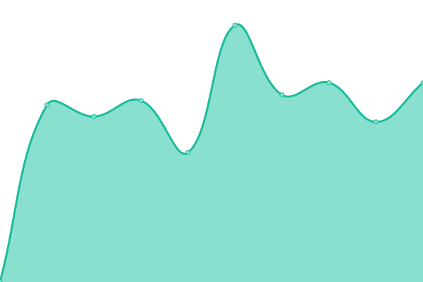
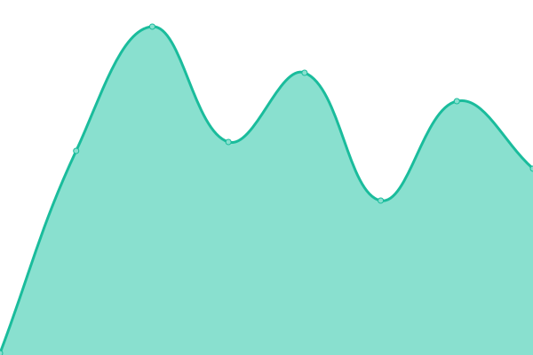
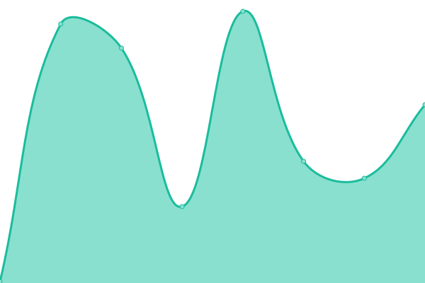
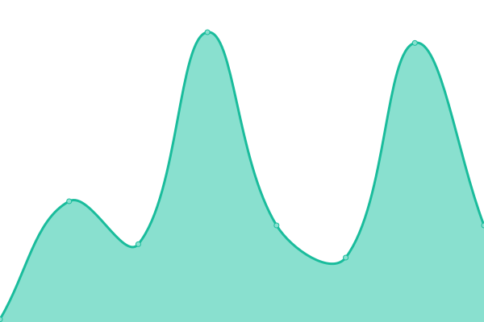
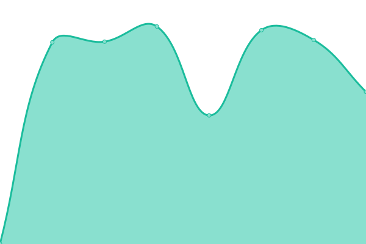
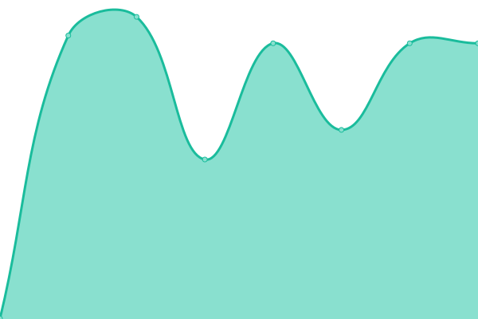
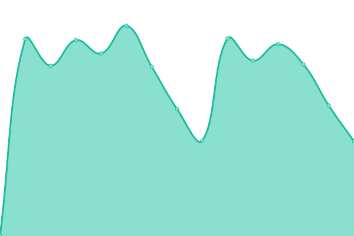
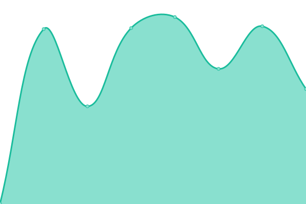
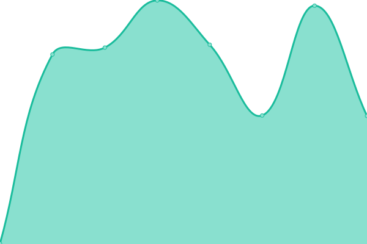

# [📈 Live Status](https://Pod-Point.github.io/devops-upptime): <!--live status--> **🟧 Partial outage**

This repository contains the open-source uptime monitor and status page for [Pod Point](pod-point.com), powered by [Upptime](https://github.com/upptime/upptime).

With [Upptime](https://upptime.js.org), you can get your own unlimited and free uptime monitor and status page, powered entirely by a GitHub repository. We use [Issues](https://github.com/Pod-Point/devops-upptime/issues) as incident reports, [Actions](https://github.com/Pod-Point/devops-upptime/actions) as uptime monitors, and [Pages](https://Pod-Point.github.io/devops-upptime) for the status page.

<!--start: status pages-->
<!-- This summary is generated by Upptime (https://github.com/upptime/upptime) -->
<!-- Do not edit this manually, your changes will be overwritten -->
<!-- prettier-ignore -->
| URL | Status | History | Response Time | Uptime |
| --- | ------ | ------- | ------------- | ------ |
|  [Pod Point](https://www.pod-point.com) | 🟩 Up | [pod-point.yml](https://github.com/Pod-Point/up/commits/HEAD/history/pod-point.yml) | 

 1598ms
     
 | 

<a href="https://Pod-Point.github.io/up/history/pod-point">100.00%</a>
    

|  [Pod Point NO](https://pod-point.no/) | 🟩 Up | [pod-point-no.yml](https://github.com/Pod-Point/up/commits/HEAD/history/pod-point-no.yml) | 

 962ms
     
 | 

<a href="https://Pod-Point.github.io/up/history/pod-point-no">100.00%</a>
    

|  [Pod Point Uk](http://pod-point.co.uk/) | 🟩 Up | [pod-point-uk.yml](https://github.com/Pod-Point/up/commits/HEAD/history/pod-point-uk.yml) | 

 1053ms
     
 | 

<a href="https://Pod-Point.github.io/up/history/pod-point-uk">100.00%</a>
    

|  [Pod Point Brand website](https://brand.pod-point.com/) | 🟩 Up | [pod-point-brand-website.yml](https://github.com/Pod-Point/up/commits/HEAD/history/pod-point-brand-website.yml) | 

 171ms
     
 | 

<a href="https://Pod-Point.github.io/up/history/pod-point-brand-website">100.00%</a>
    

|  [Arch2 API](https://api-dist.pod-point.com/v3/pods/config/time) | 🟩 Up | [arch2-api.yml](https://github.com/Pod-Point/up/commits/HEAD/history/arch2-api.yml) | 

 187ms
     
 | 

<a href="https://Pod-Point.github.io/up/history/arch2-api">100.00%</a>
    

|  [Arch2 SS API](https://api-dist.pod-point.com/v3/pods/config/time) | 🟩 Up | [arch2-ss-api.yml](https://github.com/Pod-Point/up/commits/HEAD/history/arch2-ss-api.yml) | 

 47ms
     
 | 

<a href="https://Pod-Point.github.io/up/history/arch2-ss-api">100.00%</a>
    

|  [Api Proxy to Arch2 API](https://api-proxy.pod-point.com/v3/pods/config/time) | 🟩 Up | [api-proxy-to-arch2-api.yml](https://github.com/Pod-Point/up/commits/HEAD/history/api-proxy-to-arch2-api.yml) | 

 388ms
     
 | 

<a href="https://Pod-Point.github.io/up/history/api-proxy-to-arch2-api">100.00%</a>
    

|  [Charging map](https://charge.pod-point.com/) | 🟩 Up | [charging-map.yml](https://github.com/Pod-Point/up/commits/HEAD/history/charging-map.yml) | 

 3036ms
     
 | 

<a href="https://Pod-Point.github.io/up/history/charging-map">100.00%</a>
    

|  [MIS](https://admin.pod-point.com/login) | 🟥 Down | [mis.yml](https://github.com/Pod-Point/up/commits/HEAD/history/mis.yml) | 

 978ms
     
 | 

<a href="https://Pod-Point.github.io/up/history/mis">100.00%</a>
    

|  [Ordering Tool](https://ordering.pod-point.com/login) | 🟩 Up | [ordering-tool.yml](https://github.com/Pod-Point/up/commits/HEAD/history/ordering-tool.yml) | 

 498ms
     
 | 

<a href="https://Pod-Point.github.io/up/history/ordering-tool">100.00%</a>
    

|  [API 3](https://api3.pod-point.com/) | 🟩 Up | [api-3.yml](https://github.com/Pod-Point/up/commits/HEAD/history/api-3.yml) | 

 491ms
     
 | 

<a href="https://Pod-Point.github.io/up/history/api-3">100.00%</a>
    

|  [Auth Service](https://auth.pod-point.com) | 🟩 Up | [auth-service.yml](https://github.com/Pod-Point/up/commits/HEAD/history/auth-service.yml) | 

 588ms
     
 | 

<a href="https://Pod-Point.github.io/up/history/auth-service">100.00%</a>
    

|  [Charges API](https://charges-api.pod-point.com/status) | 🟩 Up | [charges-api.yml](https://github.com/Pod-Point/up/commits/HEAD/history/charges-api.yml) | 

 441ms
     
 | 

<a href="https://Pod-Point.github.io/up/history/charges-api">100.00%</a>
    

|  [Commissiong Service](https://commission.pod-point.com/) | 🟩 Up | [commissiong-service.yml](https://github.com/Pod-Point/up/commits/HEAD/history/commissiong-service.yml) | 

 478ms
     
 | 

<a href="https://Pod-Point.github.io/up/history/commissiong-service">100.00%</a>
    

|  [RFID API](http://rfid.pod-point.com/status) | 🟩 Up | [rfid-api.yml](https://github.com/Pod-Point/up/commits/HEAD/history/rfid-api.yml) | 

 267ms
     
 | 

<a href="https://Pod-Point.github.io/up/history/rfid-api">100.00%</a>
    

|  [Contractors Tool](https://contractors.pod-point.com/auth/login) | 🟩 Up | [contractors-tool.yml](https://github.com/Pod-Point/up/commits/HEAD/history/contractors-tool.yml) | 

 555ms
     
 | 

<a href="https://Pod-Point.github.io/up/history/contractors-tool">100.00%</a>
    

|  [Dealerships Tool](https://partners.pod-point.com/auth/login) | 🟩 Up | [dealerships-tool.yml](https://github.com/Pod-Point/up/commits/HEAD/history/dealerships-tool.yml) | 

 625ms
     
 | 

<a href="https://Pod-Point.github.io/up/history/dealerships-tool">100.00%</a>
    

|  [Charges API](https://charges-api.pod-point.com/status) | 🟩 Up | [charges-api.yml](https://github.com/Pod-Point/up/commits/HEAD/history/charges-api.yml) | 

 441ms
     
 | 

<a href="https://Pod-Point.github.io/up/history/charges-api">100.00%</a>
    

|  [Partners Portal](https://partners.pod-point.com/auth/login) | 🟩 Up | [partners-portal.yml](https://github.com/Pod-Point/up/commits/HEAD/history/partners-portal.yml) | 

 137ms
     
 | 

<a href="https://Pod-Point.github.io/up/history/partners-portal">100.00%</a>
    

|  [PDF Service](https://pdf.pod-point.com/) | 🟩 Up | [pdf-service.yml](https://github.com/Pod-Point/up/commits/HEAD/history/pdf-service.yml) | 

 465ms
     
 | 

<a href="https://Pod-Point.github.io/up/history/pdf-service">100.00%</a>
    

|  [PP Docs API](https://docs.pod-point.com/) | 🟩 Up | [pp-docs-api.yml](https://github.com/Pod-Point/up/commits/HEAD/history/pp-docs-api.yml) | 

 569ms
     
 | 

<a href="https://Pod-Point.github.io/up/history/pp-docs-api">100.00%</a>
    

|  [OCPP Service](https://ocpp.pod-point.com/health-check) | 🟩 Up | [ocpp-service.yml](https://github.com/Pod-Point/up/commits/HEAD/history/ocpp-service.yml) | 

 461ms
     
 | 

<a href="https://Pod-Point.github.io/up/history/ocpp-service">100.00%</a>
    

<!--end: status pages-->

[**Visit our status website →**](https://Pod-Point.github.io/devops-upptime)

## 📄 License

- Powered by: [Upptime](https://github.com/upptime/upptime)
- Code: [MIT](./LICENSE) © [Pod Point](pod-point.com)
- Data in the `./history` directory: [Open Database License](https://opendatacommons.org/licenses/odbl/1-0/)
